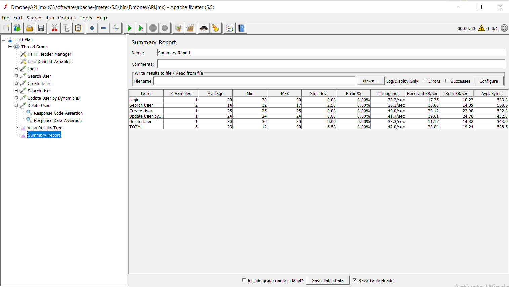
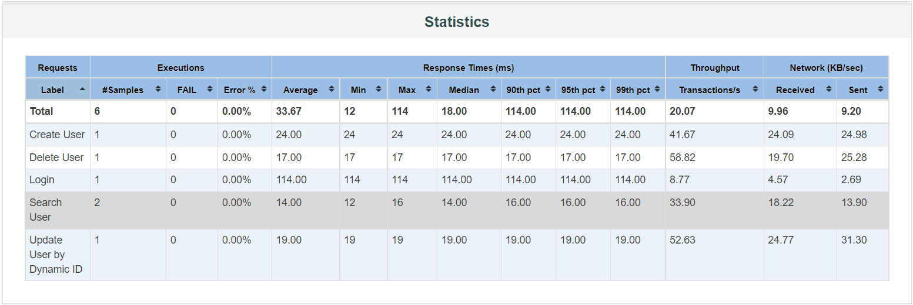

# Dmoney User API in Jmeter

- [API](http://dmoney.professionaltrainingbd.com/)

### **How to run this project**

## **Clone From**:

```
git clone https://github.com/ratnakarmaker/dmoney-user-api-jmeter
```

- Move jmx file into \apache-jmeter-5.5\bin path
- Open in windows terminal or git bash terminal and run below command

```
jmeter -n -t "DmoneyAPI.jmx" -l "DmoneyAPI.csv" -e -o Reports
```
## Steps
- Create user
- Search user
- Update user by id
- Delete user


|               Summary Report               |
| :----------------------------------------: |
|  |


|               HTML Report               |
| :----------------------------------------: |
|  |

